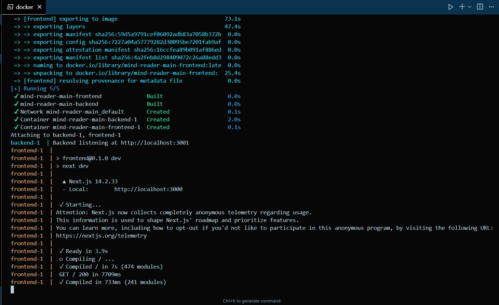

# 🧠 Mind Reader AI

A **20 Questions AI Mind Reader Game** with 8-bit pixel art style. The AI uses a decision tree algorithm to guess what you're thinking and **learns from every game**!



## 🚀 How to Run

### Step 1: Start Backend (Terminal 1)

```bash
cd backend

# Create virtual environment (first time only)
python -m venv venv

# Activate virtual environment
# Windows:
venv\Scripts\activate
# Mac/Linux:
source venv/bin/activate

# Install dependencies (first time only)
pip install -r requirements.txt

# Start server
python app.py
```

Backend runs on: **http://localhost:3001**

### Step 2: Start Frontend (Terminal 2)

```bash
cd frontend

# Install dependencies (first time only)
npm install

# Start development server
npm run dev
```

Frontend runs on: **http://localhost:3000**

### Step 3: Play!

Open your browser to **http://localhost:3000**

---

## 🎮 How to Play

1. Think of any object, animal, or thing
2. Answer YES/NO questions from the AI
3. AI guesses your thought in ~20 questions
4. If AI guesses wrong, teach it - it will remember!

---

## ✨ Features

- **🤖 AI Learning**: Decision tree grows with every game
- **🎨 8-bit Pixel Art**: Retro gaming aesthetic
- **💾 Persistent Memory**: Learned objects are saved
- **🌳 Dynamic Questions**: Not hardcoded - AI adapts

---

## 🛠️ Tech Stack

- **Backend**: Python 3.11+, Flask, Flask-CORS
- **Frontend**: Next.js 14, TypeScript, Tailwind CSS

---

## 📁 Project Structure

```
Mind-Reader/
├── backend/
│   ├── app.py              # Flask server + AI logic
│   ├── requirements.txt    # Python dependencies
│   └── decision_tree.json  # AI knowledge (auto-generated)
├── frontend/
│   └── src/app/
│       ├── page.tsx        # Main game UI
│       └── globals.css     # Styles
└── README.md
```

---

## 🔌 API Endpoints

- `POST /api/game/start` - Start new game
- `POST /api/game/answer` - Submit YES/NO answer
- `POST /api/game/learn` - Teach AI new object
- `GET /api/objects` - List all known objects

---

## 🐛 Troubleshooting

**Backend won't start:**
```bash
cd backend
venv\Scripts\activate  # or: source venv/bin/activate
pip install -r requirements.txt
python app.py
```

**Frontend won't start:**
```bash
cd frontend
npm install
npm run dev
```

**Can't connect:**
- Make sure backend is running on port 3001
- Check browser console for errors
- Try refreshing the page

---

## 📄 License

MIT License

---

**Made with ❤️** | Think hard. The AI is watching. 👁️
